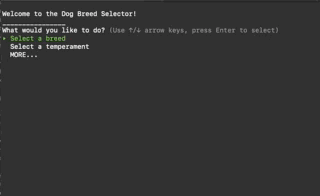
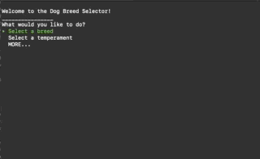

# Dog Breed Selector

A CLI application for querying, editing, and interacting with information on different dog breeds based on breed attributes and size.  Solo project.



## Built With...

- <a href="https://www.ruby-lang.org/en/">Ruby</a>
- <a href="https://github.com/piotrmurach/tty-prompt">TTY Prompt </a>

---

## Current Features 

* Extensive dataset pulled from <a href="https://dog.ceo/dog-api/documentation/">TheDogAPI</a>
* Search all dog breeds based on temperament and/or size
* Full CRUD functionality
* Ability to Add, Edit, or Delete breeds or attributes 
* Interactive voting feature for 'upvoting' favorite breeds
* Dynamic attribute/breed list that orders itself based on user votes

## Examples

```ruby

    def self.ordered_array_of_breeds_based_on_votes(temperament_name)
        temp = Temperament.find_by(name: temperament_name)
        breed = Temperament.see_breeds(temperament_name)
        selected = breed.map { |names| Breed.find_by(name: names)}
        breed_id = selected.map {|b| b.id}
        found = breed_id.map { |ids| Personality.find_by(breed_id: ids, temperament_id: temp.id)}
        flipped = found.sort_by{|n| n.votes}.reverse
        sorted = flipped.map{|p| p.breed}
        sorted_breeds_based_on_votes = sorted.map{|breeds| breeds.name}
    end 
```



### Weight Search

```ruby

    elsif menu == choices[2]
        ##START MORE
        weight_menu = prompt.select("What size dog are you looking for?", weight_classes)
        temperament_menu = prompt.select("And what sort of temperament?", all_temperaments, filter: true)

            if weight_menu == weight_classes[0]
                breed_list = Temperament.see_breeds(temperament_menu)
                pp weighted_breeds = Breed.small_dogs(breed_list)

            elsif weight_menu == weight_classes[1]
                breed_list = Temperament.see_breeds(temperament_menu)
                pp weighted_breeds = Breed.medium_dogs(breed_list)

            elsif weight_menu == weight_classes[2]
                breed_list = Temperament.see_breeds(temperament_menu)
                pp weighted_breeds = Breed.large_dogs(breed_list)

            elsif weight_menu == weight_classes[3]
                breed_list = Temperament.see_breeds(temperament_menu)
                pp weighted_breeds = Breed.extra_large_dogs(breed_list)
            end
```

---

## Feedback

Feel free to reach out on <a href="http://www.linkedin.com/in/christineadoherty">LinkedIn</a> with any thoughts or feedback!

Thanks for checking out this repo!!

    
